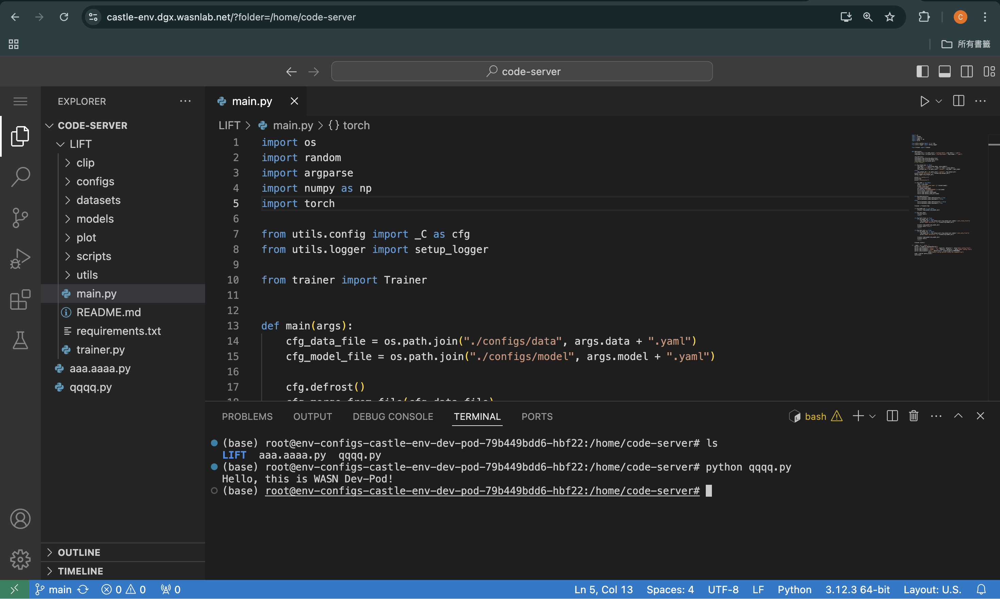
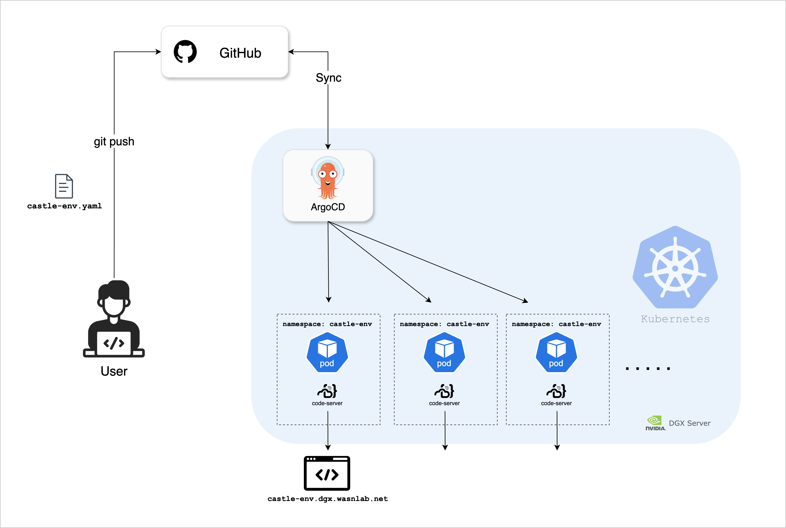
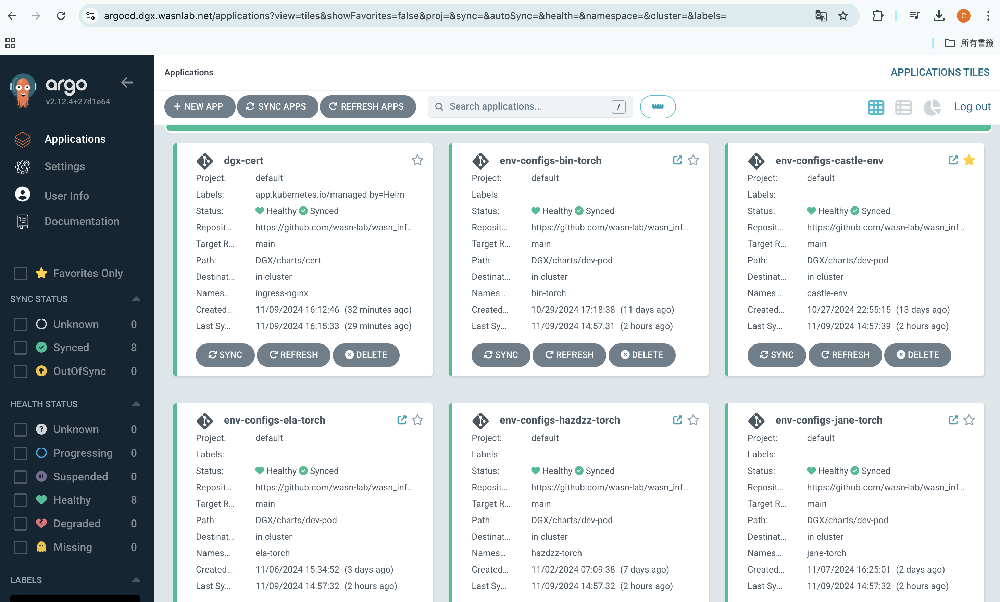
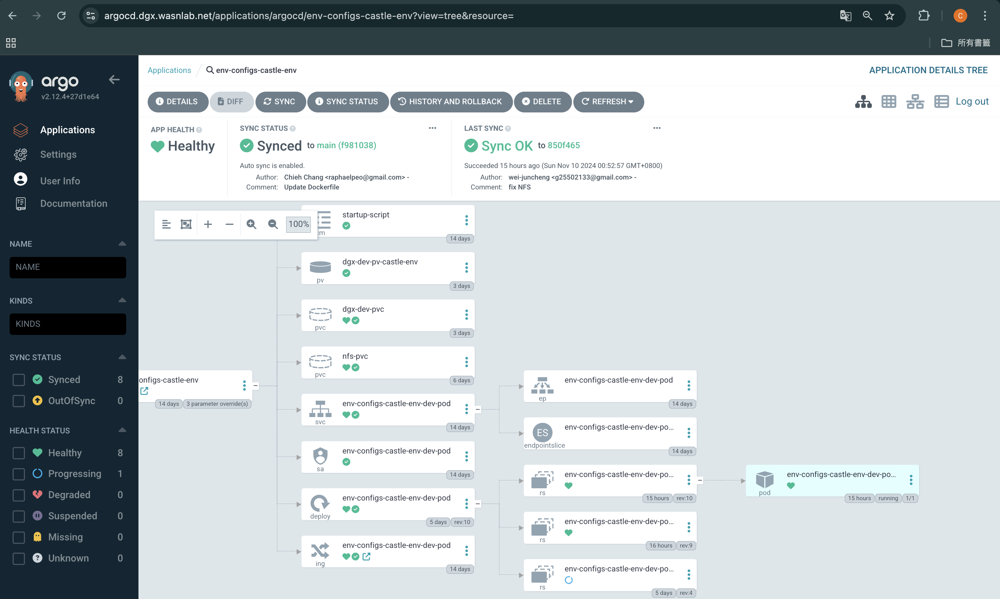
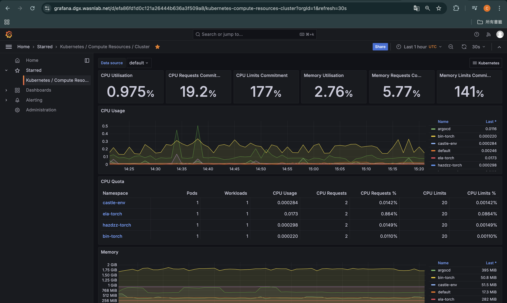

# WASN P40 Dev Pod
[](https://github.com/wasn-lab/P40_Dev_Pod/blob/main/README.md)
[](https://wasn.csie.ncu.edu.tw/)

### A Flexible Development Environment


<!-- toc -->
- [What is P40 Dev Pod?](#what-is-p40-dev-pod)
- [More About Dev Pod](#more-about-dev-pod)
- [Getting Started](#getting-started)
    - [Prerequisite](#prerequisite)
    - [Creating Configuration File](#creating-configuration-file)
    - [Waiting for Deployment](#️waiting-for-deployment)
    - [Start Using](#start-using)
    - [Monitoring](#monitoring)
        - [ArgoCD](#argocd)
        - [Grafana](#grafana)
    - [Note](#️-note)
- [Update Your Environment](#update-your-environment)
<!-- tocstop -->
## 非常重要！！！！！！！！！！！！
由於P40是放在外網，所以如果要用域名訪問的話，必須在自己的etc/hosts文件下面添加DNS記錄。

訪問的時候要加port。http:30080 https:30443

範例：https://argocd.p40.wasnlab.net:30443

由於放在外網，所以有一定資安疑慮，請頻繁備份自己的資料！！！！！！！！

Argocd 登入的賬號密碼（跟DGX不一樣，不能透過github登入）可以傳訊息給網關詢問。

### Windows
```
路徑：C:\Windows\System32\drivers\etc\hosts
hosts文件添加
140.115.54.239   argocd.p40.wasnlab.net
140.115.54.239   example.p40.wasnlab.net  # example需要根據你'name-env.yaml'檔替換，比如你的是leo-env.yaml 那就要改成leo-env.p40.wasnlab.net
```
### Linux|Mac
```
路徑：/etc/hosts
hosts文件添加
140.115.54.239   argocd.p40.wasnlab.net
140.115.54.239   example.p40.wasnlab.net  # example需要根據你'name-env.yaml'檔替換，比如你的是leo-env.yaml 那就要改成leo-env.p40.wasnlab.net
```
## What is P40 Dev Pod?
The P40 Dev Pod is an experimental platform that allows students to freely choose the development environment they want to use.

## More About P40 Dev Pod
P40 Dev Pod utilizes [Kubernetes](https://kubernetes.io/), [ArgoCD](https://argo-cd.readthedocs.io/en/stable/) and [Helm](https://helm.sh/) to establish an automated deployment flow.

This project is hosted on a on-premises Kubernetes cluster and utilizes a GitOps flow to enable version control for infrastructure configurations. ArgoCD plays a crucial role in this project, allowing students to flexibly choose the container image they need for experiments. ArgoCD continuously monitors the `main` branch of this Git repository. Students simply need to `git push` their environment configuration YAML files to the Git repository, and ArgoCD will automatically create a dedicated namespace for the student, provision a Kubernetes Pod and Ingress within that namespace, and launch [code-server](https://github.com/coder/code-server) in the Pod to accept external connections. This setup allows students to directly access a VS Code-like editor from their web browser to write code and conduct experiments.




## Getting Started
> **[繁體中文說明](#中文版)** 
### Prerequisite
- For security reasons, this system currently only allows access from the internal network. Please connect to the WASN lab's internal network first.
    - You can also connect through the lab’s VPN or by connecting to WASN lab’s Wi-Fi.
- Your GitHub account must be a member of the `Members` or `Owner` team in [wasn-lab](https://github.com/wasn-lab)

### 📝Creating Configuration File
- Please create an environment configuration file for your setup in the [env-configs/](/env-configs/) directory of the P40_Dev_Pod project.
    - Name it according to your environment, for example: `castle-env`. In my case, I created the file `castle-env.yaml`.
    - You can copy the template below, filling in your namespace, the Docker image name you need, and whether you will use a GPU.
      - ```
        # Your Name
        createdBy: castle.cheng
        #-----------------------------

        # Please name your Kubernetes namespace, which will separate different users' environments. 
        # This name will also be used to create your unique domain name URL.
        # For example: If your namespace is castle-env, your environment will be available at https://castle-env.p40.wasnlab.net
        namespace: castle-env

        # Enter the Docker image you intend to use in your development environment, specifying the full Docker image name and tag.
        # Example: jupyter/docker-stacks-foundation:latest
        docker_image: jupyter/docker-stacks-foundation:latest

        # Indicate whether you need to use a GPU.
        gpu_enabled: false
        ```
    - Due to limited hardware resources, each student is allocated only 1 GPU by default. If you need additional GPU resources, you may request approval from the WASN administrator.

- You can create a new file directly on the GitHub page or clone this project to your computer and push the new configuration file to the main branch of this repository via Git.

### ☕️Waiting for Deployment
- After creating your environment configuration file, please wait 3–5 minutes for your dedicated environment to be set up.
    - During this time, [ArgoCD](https://argo-cd.readthedocs.io/en/stable/) will read the configuration file you just created and, using [Helm](https://helm.sh/), will create your namespace on the P40 Kubernetes cluster, download the specified container image, and launch [code-server](https://github.com/coder/code-server) within the pod. You will then be able to connect directly to the container through your browser for development!

### 🎉Start Using
- In your browser, enter：`https://<your-environment-name>.p40.wasnlab.net`
    - Replace`<your-environment-name>`with the value you provided in the namespace field of your YAML file. (For example, if your environment name is castle-env, then your URL will be `https://castle-env.p40.wasnlab.net`).
- Welcome!
    - 

### 📊Monitoring
#### ArgoCD
- You can log in to the ArgoCD dashboard using your GitHub account at: https://argocd.p40.wasnlab.net/ to check whether your environment has been successfully created or if there are any error messages.
    - Here, you can locate your environment to verify the deployment status of various Kubernetes components and view the Pod logs
        - The naming convention is: `env-config-<your-environment-name>`
    > Your GitHub account must be a member of the `Members` or `Owner` team in [wasn-lab](https://github.com/wasn-lab) to view content on ArgoCD. You may request access from the WASN lab administrator if needed.

    - 
    - 

#### Grafana
- You can log in to the Grafana dashboard with your GitHub account at: [https://grafana.p40.wasnlab.net/](https://grafana.p40.wasnlab.net/d/efa86fd1d0c121a26444b636a3f509a8/kubernetes-compute-resources-cluster?orgId=1&refresh=30s) to monitor various metrics for the entire cluster, including CPU, memory, and network usage across all namespaces. The following dashboards provide a comprehensive view of resource usage:
    - [Kubernetes / Compute Resources / Cluster](https://grafana.p40.wasnlab.net/d/efa86fd1d0c121a26444b636a3f509a8/kubernetes-compute-resources-cluster?orgId=1&refresh=30s)View resource usage for the entire Kubernetes cluster.
        - 
    - [Kubernetes / Compute Resources / Namespace (Pods)](https://grafana.p40.wasnlab.net/d/85a562078cdf77779eaa1add43ccec1e/kubernetes-compute-resources-namespace-pods?orgId=1&refresh=30s&from=now-1h&to=now)Select a specific namespace to view detailed resource usage for that namespace.
        - 
    - [NVIDIA GPU Dashboard](https://grafana.p40.wasnlab.net/d/Oxed_c6Wz/nvidia-dcgm-exporter-dashboard?orgId=1&from=now-3h&to=now) Check the GPU status, including temperature, power, and usage.
        - 

### ⚠️ Note
 - The development environment created here is temporary. Only data stored under the default directory `/home/code-server` will be preserved properly. Other parts of the environment, such as installed Python packages, will be lost if the Pod is rebuilt. Rebuilds can occur when you change the container image, adjust GPU settings, or during system updates. Therefore, it is strongly recommended to use `requirements.txt`, [Poetry](https://python-poetry.org/), or another package management tool to ensure that the packages required for development are consistently available.

- Using an outdated container image may prevent code-server from installing correctly. In such cases, you will see the Pod repeatedly restarting in ArgoCD. Please switch to a more recent container image or contact the administrator. If you're unsure which container image to use, you can check other students' configurations in env-configs.

    - Currently confirmed usable container images:
        - `hazdzz/p40-torch:1.0.6`
        - `pytorch/pytorch:2.3.1-cuda12.1-cudnn8-devel`
        - `pytorch/pytorch:2.4.1-cuda12.4-cudnn9-devel`
        - `nvcr.io/nvidia/pytorch:24.04-py3`
        - `nvcr.io/nvidia/pytorch:24.05-py3`

## Update Your Environment
- If you need to switch to a different Docker image for your development environment, you can directly edit the environment configuration file you created. After making the changes, simply `git push`, and ArgoCD will automatically update your Pod environment. This process takes about 5 minutes. You can log in to the ArgoCD dashboard with your GitHub account at https://argocd.p40.wasnlab.net/ to check if your environment has been successfully set up or if there are any error messages.


## 📝Learning
- If you're interested in Kubernetes or Helm, feel free to contact Wei-Jun. We can provide an in-depth explanation of the technologies used to set up this project.
    - [wasn_infra](https://github.com/wasn-lab/wasn_infra/tree/main/P40)
        - Include all Helm settings and deployment yaml
        - This repository requires permissions in [wasn-lab](https://github.com/wasn-lab) to access


## 中文版
### Prerequisite
- 為了資安考量，這個系統目前只允許內網存取。請先連線至WASN實驗室內網
    - 你可以也透過實驗室VPN或連接WASN實驗室的Wifi
- 你的GitHub帳號必須要屬於[wasn-lab](https://github.com/wasn-lab)這個GitHub組織中的`Members` or `Owner`

### 📝Creating Configuration File
- 請在這個專案中的[env-configs/](/env-configs/)建立一份屬於你的環境設定檔
    - 為你自己的環境命名，例如：`castle-env`，我就創建檔案：`castle-env.yaml`
    - 你可以直接複製以下模板，並填入你的namespace、你需要使用的docker image名稱以及是否要使用GPU
      - ```
        # 你的名字
        createdBy: castle.cheng
        #-----------------------------

        # 請為你的kubernetes的namespace命名，用來分隔不同使用者的環境，這個名稱也會用於創建屬於你的domain name網址
        # 例如: castle-env 你的環境就會是 https://castle-env.p40.wasnlab.net
        namespace: castle-env

        # 填入你開發環境內要使用的Docker image，需要填寫完整docker image name跟tag
        # 例如: jupyter/docker-stacks-foundation:latest
        docker_image: jupyter/docker-stacks-foundation:latest

        # 是否要使用GPU
        gpu_enabled: false
        ```
    - 由於硬體資源有限，預設每個學生只會使用1顆GPU，如果你需要使用更多GPU資源，可以向WASN管理員提出申請

- 你可以直接在GitHub頁面上建立新檔案，或是你將這個專案clone到你的電腦，再透過Git將你新建的設定檔推送到這個repositoy的main branch上

### ☕️Waiting for Deployment
- 建立好你的環境設定檔之後，等待3~5分鐘你專屬的環境就會建立完成
    - 這段時間[ArgoCD](https://argo-cd.readthedocs.io/en/stable/)將會讀取你剛剛建立的設定檔，並且透過[Helm](https://helm.sh/)在P40的kubernetes cluster上創建你的namespace並下載你所需要的container image，最後再pod中啟動[code-server](https://github.com/coder/code-server)，你就能透過瀏覽器直接連線到container內開發！

### 🎉Start Using
- 請在瀏覽器輸入：`https://<你的環境名稱>.p40.wasnlab.net`
    - `<你的環境名稱>`請換成你填寫在yaml檔裡`namespace`欄位的值（例如我的環境名稱是`castle-env`，那我的網址就是`https://castle-env.p40.wasnlab.net`）
- 歡迎！
    - 

### 📊Monitoring
#### ArgoCD
- 你可以透過GitHub帳號登入ArgoCD的儀表板：https://argocd.p40.wasnlab.net/ 確認你的環境是否成功建立或遇到任何錯誤訊息
    - 你能在這裡找到你的環境，用以確認各項Kubernetes元件的部署情況以及查看Pod的log
        - 命名規則是：`env-config-<你的namespace>`
    > 你登入的GitHub帳號必須要在[wasn-lab](https://github.com/wasn-lab)的`Members`或`Owner` team member才能看到ArgoCD的內容，你可以向WASN實驗室的管理員提出申請

    - 
    - 

#### Grafana
- 你可以透過GitHub帳號登入Grafana儀表板：[https://grafana.p40.wasnlab.net/](https://grafana.p40.wasnlab.net/d/efa86fd1d0c121a26444b636a3f509a8/kubernetes-compute-resources-cluster?orgId=1&refresh=30s)確認整個cluster的各項數據，包含所有namespace的CPU、Memory或網路的使用率。以下的dashboard分類能看到完整的資源使用狀況：
    - [Kubernetes / Compute Resources / Cluster](https://grafana.p40.wasnlab.net/d/efa86fd1d0c121a26444b636a3f509a8/kubernetes-compute-resources-cluster?orgId=1&refresh=30s)能查看整個Kubernetes cluster的資源使用狀況
        - 
    - [Kubernetes / Compute Resources / Namespace (Pods)](https://grafana.p40.wasnlab.net/d/85a562078cdf77779eaa1add43ccec1e/kubernetes-compute-resources-namespace-pods?orgId=1&refresh=30s&from=now-1h&to=now)能指定namespace，查看該namespace中的資源使用細節
        - 
    - [NVIDIA GPU Dashboard](https://grafana.p40.wasnlab.net/d/Oxed_c6Wz/nvidia-dcgm-exporter-dashboard?orgId=1&from=now-3h&to=now) 確認GPU狀況，包含溫度、電力和使用量
        - 

### ⚠️ Note
 - 這邊建立的開發環境是暫時的，將資料存放在`/home/code-server`預設目錄底下才會被妥善的保存，其餘環境例如：已安裝的python套件將會在Pod被重新建立時消失。 Pod可能會在你更改container image、GPU的設定有改動或系統更新時重建，因此強烈建議使用`requirements.txt`, [Poetry](https://python-poetry.org/)或其他套件管理工具來確保你開發所需要的套件是固定的
 - 使用太舊的container image來創造環境可能會讓code-server無法正常安裝，你將會在ArgoCD看到pod不斷的被重啟，請更換較新的container image或是跟管理員聯絡。如果你不知道該用什麼container image，你可以參考[env-configs](/env-configs/)中其他同學的設定
    - 目前確認可用的container image清單：
        - `hazdzz/p40-torch:1.0.6`
        - `pytorch/pytorch:2.3.1-cuda12.1-cudnn8-devel`
        - `pytorch/pytorch:2.4.1-cuda12.4-cudnn9-devel`
        - `nvcr.io/nvidia/pytorch:24.04-py3`
        - `nvcr.io/nvidia/pytorch:24.05-py3`

## Update Your Environment
- 如果你需要改用其他的Docker image作為開發環境，你可以直接修改你所創建的環境設定檔，重新`git push`之後就會驅動ArgoCD更新你的pod環境，大約需要等待5分鐘，你可以透過GitHub登入ArgoCD的儀表板：https://argocd.p40.wasnlab.net/ 確認你的環境是否成功建立或遇到任何錯誤訊息


## 📝Learning
- 對Kubernetes或Helm有興趣的同學可以跟偉竣聯絡，我們可以為你解析這個專案搭建的技術
    - [wasn_infra](https://github.com/wasn-lab/wasn_infra/tree/main/P40)
        - Include all Helm settings and deployment yaml
        - This repository requires permissions in [wasn-lab](https://github.com/wasn-lab) to access
